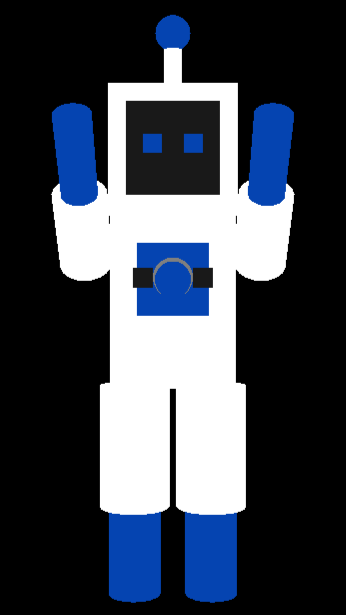
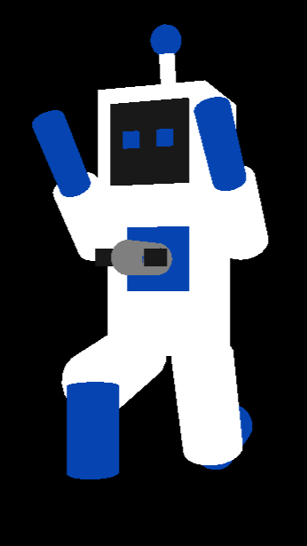

# 🤖 Robot-GL-Model

This project models a robot using OpenGL and C++ with FreeGLUT and GLEW libraries, it serves as the 3D model used in the Robot Shootout game!

---

## 📸 Screenshots

<p align="center">
  
  
</p>

<p align="center">
  <em>Front and side views of the articulated robot model.</em>
</p>

---

## ✨ Features

- Developed a 3D articulated robot model with OpenGL and GLUT.
- Implemented interactive controls for limbs and cannon turret, including smooth animation and realistic movement limits.  
- Enabled dynamic camera rotation and responsive viewport resizing.  
- Utilized basic geometric primitives and color schemes.  
- Managed animation timing and input handling for seamless real-time interaction.  


---

## 📦 Dependencies

This project relies on the following external libraries:

- [FreeGLUT](http://freeglut.sourceforge.net/) — for window creation and input handling.
- [GLEW](http://glew.sourceforge.net/) — for managing OpenGL extensions.

These libraries are included in the `Dependencies` folder in this repository for convenience.

---

## 🛠 How to Build and Run

### 🧰 Prerequisites

- Windows OS with Visual Studio 2022 (or compatible).
- C++ desktop development workload installed.

### 🚀 Steps

1. Clone this repository:

   ```bash
   git clone https://github.com/Matthew-J-Lew/Robot-GL-Model.git
   cd Robot-GL-Model
   ```

2. Open the solution file `Robot-GL-Model.sln` in Visual Studio.

3. Ensure the `Dependencies` folder is present alongside the solution file (it contains FreeGLUT and GLEW).

4. Build the solution in Visual Studio (select Debug or Release, x64 or Win32 as appropriate).

5. Run the project from Visual Studio or run the generated executable from the `x64/Debug` or `x64/Release` folder.

---

## 🎮 Controls

- **c**: Start cannon spin  
- **C**: Stop cannon spin  
- **w**: Start step animation  
- **W**: Reset all joint angles  

- **Left Arrow**: Rotate robot left  
- **Right Arrow**: Rotate robot right  

### 🤖 Joint Selection

- **q**: Left elbow  
- **e**: Right elbow  
- **a**: Left hip  
- **d**: Right hip  
- **z**: Left knee  
- **x**: Right knee  

### 🔧 Joint Rotation

- **Down Arrow**: Increase selected joint angle  
- **Up Arrow**: Decrease selected joint angle  

---

## 🪪 License

MIT License © [Matthew Lew](https://github.com/Matthew-J-Lew)

[](https://github.com/Matthew-J-Lew)
[](https://www.linkedin.com/in/matt-j-lew/)
